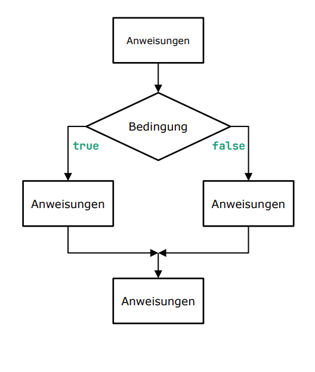
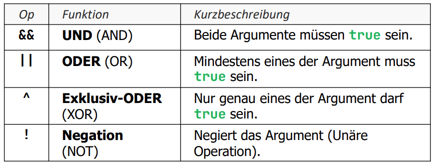

# Selektionen - Steuerung des Kontrollflusses
Bei der Programmierung erfolgen viele Aktionen in Abhängigkeit von logischen Bedingungen. Ein Beispiel dafür ist das Verhindern einer Division durch Null unter der Verwendung von if-statements. Aufgrund einer Bedingung wird der Kontrollfluss des Programms verändert. 



## Einfache Selektion in Java
- Die Bedingung (Expression) **muss** ein bool'sches Resultat geben. 
- Die Bedingung muss in Klammern (...) eingefasst sein. 
- Auch wenn in einem Anweisungsblock {...} nur ein einziges Statement steht, sollte man immer geschweifte Klammern verwenden. 
- Das **else**-Statement ist optional. 

```java
public class IfStatements {

    public static void main(String[] args) {
        int temp = 32;
        if (temp > 30) {
            System.out.println("It's a hot day");
            System.out.println("Drink water");
        } 
        else if(temp > 20 && temp <= 30) {
            System.out.println("Beautiful day");
        } 
        else {
            System.out.println("Cold time");
        }
    }
}
```
## Häufig verwendete Operatoren in if-Statements 

```java 
int a = 5;
int b = 10;

if (a > b) {
    System.out.println("a is greater than b");
} else {
    System.out.println("a is not greater than b");
}
```
```java
int num1 = 25;
int num2 = 20;

if (num1 >= num2) {
    System.out.println("num1 is greater than or equal to num2");
} else {
    System.out.println("num1 is not greater than or equal to num2");
}
```
```java
int number1 = 10;
int number2 = 10;

if (number1 == number2) {
    System.out.println("number1 is equal to number2");
} else {
    System.out.println("number1 is not equal to number2");
}
```
```java
double price1 = 10.99;
double price2 = 9.99;

if (price1 != price2) {
    System.out.println("The prices are not equal");
} else {
    System.out.println("The prices are equal");
}
```
Strings vergleichen mit der .equals() Methode
```java
String name1 = "John";
String name2 = "John";

if (name1.equals(name2)) {
    System.out.println("The names are equal");
} else {
    System.out.println("The names are not equal");
}
```
## Logische bool'sche Operatoren
- Operatoren für bool'sche Variablen oder Ausdrücke 
-> Ergebnis der Operation wird wieder ein bool'scher Wert. 
- Einzelne Bedingungen werden zu komplexeren Bedingungen verknüpft
### Übersicht der wichtigsten Operatoren 

Beispiele: 
```java 
boolean isJavaFun = true;
boolean isProgrammingEasy = true;
// Returnt true wenn beide Aussagen stimmen
if (isJavaFun && isProgrammingEasy) {
    System.out.println("Java programming is fun and easy.");
} else {
    System.out.println("Java programming is not both fun and easy.");
}
```
```java
boolean hasJavaExperience = false;
boolean hasPythonExperience = true;
// Returnt true wenn eine oder beide Aussagen stimmen
if (hasJavaExperience || hasPythonExperience) {
    System.out.println("The person has experience in either Java or Python.");
} else {
    System.out.println("The person has no relevant programming experience.");
}
```
```java 
boolean isSunny = true;
boolean isRaining = true;
// Returnt true wenn genau eine Aussage stimmt
if (isSunny ^ isRaining) {
    System.out.println("It's either sunny or raining, but not both.");
} else {
    System.out.println("It's either not sunny, not raining, or both.");
}
```
```java 
boolean isCloudy = true;
// Negation
if (!isCloudy) {
    System.out.println("It's not cloudy, which means it's sunny!");
} else {
    System.out.println("It's cloudy.");
}
```
### Gesetz von De Morgan 
- Zwei gleichwertige Formulierungen 
```java
!(a && b) == !a || !b
!(a || b) == !a && !b
```
- Eine AND-Operation lässt sich durch eine OR-Operation (und umgekehrt) ersetzen, wenn man gleichzeitig sowohl die einzelnen Argumente als auch das Resultat negiert.

### If-Statements Empfehlungen
- Anweisungsblöcke immer mit geschweiften Klammern, sonst passieren bei erweiterungen Fehler. 
```java
// nicht so 
if (bedingung)
    System.out.println("Hello World");

// sondern so
if (bedingung) {
    System.out.println("Hello World");
}
```
- Versuchen den häufigeren Fall möglichst im then-Block zu implementieren, und die Ausnahmen (seltenerer Fall) im else-Block. 
- Leere else-Blöcke weglassen.
- Variablen/Parameter vom Typ boolean können direkt als Expression verwendet werden. 
```java
boolean bedingung = true;

if (bedingung) {
    System.out.println("Die Bedingung ist wahr.");
}

// Oder

if (!bedingung) {
    System.out.println("Die Bedingung ist falsch.");
}
``` 
- wenn ein bool'scher WErt als Resultat benötigt wird, braucht es kein if-Statement
```java
// nicht so  
    if (x < 3) {
        return true;
    } else {
        return false;
    }

// sondern so
return (x < 3);
```
### else-if-statement
- Formulierung von sich gegegenseitig Ausschliessenden Optionen. 
```java
public static void main(String[] args) {
    int temp = 32;
    if (temp > 30) {
        System.out.println("It's a hot day");
        System.out.println("Drink water");
    } 
    else if(temp > 20 && temp <= 30) {
        System.out.println("Beautiful day");
    } 
    else {
        System.out.println("Cold time");
    }
}
```
### switch-Statement
- Ähnlich wie if-Statements jedoch auch **absolute Werte** beschränkt (Also keine Bedingungen).
- Funktioniert nur mit byte, short, char, int(also ohne long). 
- Funktioniert auch mit der Klasse String und Enumerations-Typen.

!Achtung!
- Das switch-Statement hat ein spezielles Verhalten: Sobald ein case zutrifft, werden die Statements dieses, aber auch **alle folgenden** Fälle abgearbeitet. Darum muss man am Ende jedes case ein break-Statement verwenden. 
```java
String role = "admin"; 

switch (role) {
    case "admin":
        System.out.println("You're an admin");
        break;
    case "moderator":
        System.out.println("You're a moderator");
        break;
    default:
        System.out.println("You're a guest");
        // kein break da es das letzte Statement ist
}

```
#### switch-Statement mit "fall through"
```java
switch (value) {
    case 1:
    case 2:
    case 3:
    case 4:
    case 5:
        typ = "Arbeitstag";
        break;
    case 6:
    case 7:
        typ = "Wochenende";
        break;
    default:
        typ = "nicht erlaubte Tagnummer";
}
``` 
#### switch-Statement-Mehrfachselektion 
- Liefert zu einer Tagnummer (int value) die Art des Tages
```java
switch (value) {
    case 1, 2, 3, 4, 5: 
        typ = "Arbeitstag";
        break; // break notwendig
    case 6, 7:
        typ = "Wochenende";
        break; // break notwendig
    default:
        typ = "Unerlaubte Tagnummer";
}
```
#### switch-Expression - mit Arrow Labels 
```java
String daytype = switch (value) {
    case 1, 2, 3, 4, 5 -> "Arbeitstag";
    case 6, 7 -> "Wochenende";
    default -> "Unerlaubte Tagnummer";
}
// break nicht notwendig das es hier kein fall-through gibt. 
```
#### switch-Expressions - mit Codeblock und yield
- Bei Verwendung eines Codeblockes muss das Schlüsselwort yield genutzt werden, um die switch-Expression mit dem gewünschten WErt zu verlassen (Analog zu einem return aus einer ganzen Funktion)
```java
String daytype = switch (value) {
    case 1, 2, 3, 4, 5 -> {
        String name = "Arbeitstag(" + value + ")";
        LOG.info("Es ist {}.", name);
        yield name;
    }
    case 6, 7 -> "Wochenende";
    default -> "Unerlaubte Tagnummer";
}
```