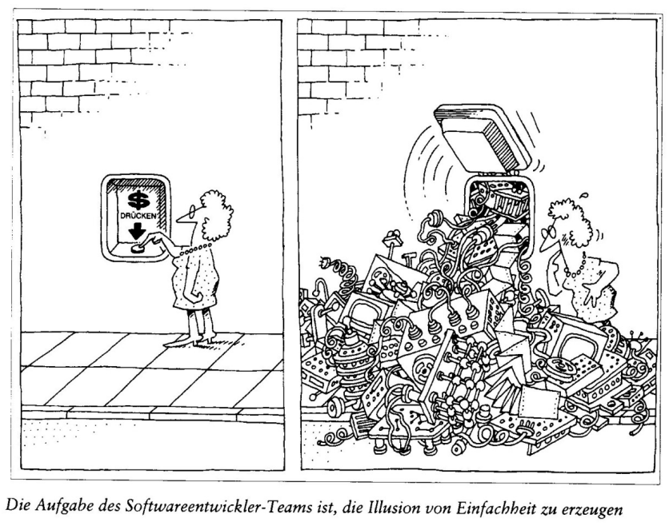

# Schnittstellen
## Abstraktion - Vereinfachung zur Modellierung
- Vereinfachung bzw. Reduktion der Realität auf das im jeweiligen Kontext unmittelbar **Notwendige**.
- Wenn wir direkt Klassen entwerfen, abstrahieren wir typisch aus einer "Innenperspektive": 
    - Identifikation von Attributen: Daten zur **internen** Representation des Zustandes. 
    - Identifikation des Verhaltens: Öffentliche als auch private (interne) Methoden zur Umsetzung dessen. 
- In einem ersten Schritt genügt häudig die "Aussenperspektive": 
    - Nur Identifikation der Methoden (Verhalten) mit allfälligen Parametern und Rückgabewerten! -> **Nutzendensicht!**

- Wir können Abstraktion zusätzlich verstärken, indem wir konsequent zwischen dem **Was** und **Wie** unterscheiden. 
- Beispiel: Schnittstelle für das Auslösen eines Geldbezuges (Hier eine einfache Taste)
    - Die hochkomplexe Realisation des Vorgangs bleibt hinter einer vergleichsweise einfachen Schnittstelle vollständig verborgen. 

## Modularisierung
